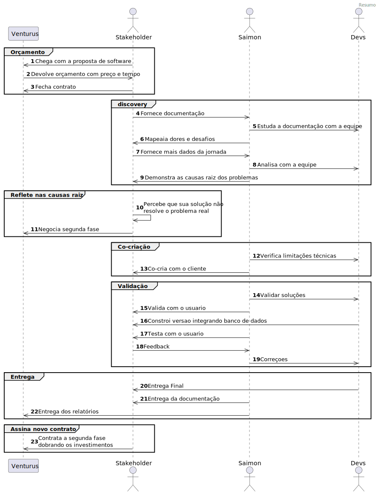

    

<!-- One -->
<section id="Resumo">

    

    <h2 id="content">Ficha técnica</h2>
    
 Como UX designer, minha empresa foi contratada por um grupo de engenheiros que queria automatizar a parte das planilhas do seu processo semi-automatizado.Eles trabalham em uma grande multinacional e o seu setor é a impressão de cartões inteligentes. Meu primeiro passo foi realizar entrevistas com os usuários para entender como eles trabalhavam e identificar suas principais dores e desafios. Durante esse processo, pude mapear os problemas e descobrir que o software encomendado pelos engenheiros até ajudava no trabalho, mas não resolvia o problema principal. Os resultados da minha descoberta impressionaram tanto os engenheiros que eles mesmos propuseram uma segunda fase para o projeto, sem nem termos entregue a primeira fase ainda, dobrando o investimento inicial que haviam feito. Trabalhei em colaboração com outros membros da equipe para validar minhas soluções de design e obter feedback. Além disso, defini métricas claras para medir o sucesso do projeto e monitorei de perto essas métricas ao longo do tempo. O resultado foi ainda mais impactante - uma redução de 87% nas multas de atraso de entrega, 80% na quantidade de erros de produção e 30% no tempo de correções.

    

    <h2 id="resultados">Resultados</h2>

    

        

        <h1>30%</h1>
        
de economia no tempo de correções

        

    

    

        

        <h1>80%</h1>
        
de diminuição dos erros de produção 

        

    

    

      

        <h1>87%</h1>
        
de diminuição das multas de atraso de entrega 

      

    

	

		<h3>Cliente</h3>
		
Empresa francesa que comercializa sistemas de informação e serviços para as indústrias aeroespacial, de defesa e de segurança.  Atuamos no setor de cartões inteligentes. O setor em questão faz o chip, impressão, gravação dos dados, manipulação e envio dos cartões de diversas operadoras.

	

	

		<h3>O Projeto</h3>
		
Sistema para gestão e acompanhamento de Change Request solicitadas pela operadora. Essas mudanças podem ser cor do cartão, local das informações, material, tipo de impressão, formato de envelope, materiais de propaganda, forma de envio, dentre outros.
        

	

	<!-- Break -->

	

		<h3>Delimitações</h3>
		
Projeto financiado por lei de incentivo fiscal. Isso implica em ter as entregas detalhadas no momento da proposta, antes de ter o problema bem definido.

	

	

		<h3>Equipe</h3>
		<ul>
            <li>1 UX Designer</li>
            <li>1 Gerente de projeto</li>
            <li>2 Front end</li>
            <li>2 Back End</li>
            <li>1 QA</li>
        </ul>
	

	

		<h3>Tempo</h3>
		<ul>
            <li>Fase 1 - 5 meses</li>
            <li>Fase 2 - 3 meses</li>
        </ul>
	

    

    <h2 id="content">Etapas de Design </h2>
        <ul>
            <li>Discovery</li>
            <li>Ideação e Co-criação</li>
            <li>Prototipação</li>
            <li>Teste</li>
            <li>Documentação</li>
        </ul>
    

	

		<h3>Jornada Resumida</h3>
		<ul>
            <li>Cliente solicita Change Request</li>
            <li>Customer service traduz o pedido e envia ao NP</li>
            <li>NPI avalia a viabilidade e solicita correção ou envia para a produçã</li>
            <li>Fábrica produz e envia ao cliente</li>
        </ul>
        Se a entrega passar de 5 dias úteis, uma multa de atraso é cobrada.
	

	

		<h3>Pontos de dor</h3>
        <ul>
           <li>Multiplos softwares usados</li>
           <li>Múltiplas planilhas</li>
           <li>VBA para gerar formulário desatualizado</li>
           <li>Centenas de emails diários para controle</li>
           <li> Erros de produção por falta de dependência de alterações</li>
           <li>Demora na correção dos pedidos</li>
           <li>Multas com atraso de entrega</li>
        </ul>
	

    

        <h2 id="content">Entregas </h2>
    

    <!-- Break -->

	

        <ul>
	    	<h3>Fase 1</h3>
	    	<h4>Entrega</h4>
	    	<li>Formulário online</li>
	    	<li>Aprovação por partes</li>
	    	<li>Dashboard</li>
	    	<li>Acompanhamento do status</li> 
	    	<h4>Resultado</h4>
	    	<li>Menor número de emails</li>
	    	<li>Aprovações parciais</li>
	    	<li>Menor tempo de correção</li>
        </ul>
    

	

		<ul>
            <h3>Fase 2</h3>
		    <h4>Entrega</h4>
		    <li>Cadastro de itens</li>
		    <li>Dependencias programáveis pelo usuário</li>
		    <li>Avisos globais programáveis pelo usuário</li> 
		    <h4>Resultado</h4>
		    <li>Diminuição dos erros de produção</li>
		    <li>Diminuição das multas por atraso</li>
        </ul>
    

	

		<ul>
            <h3>Extras</h3>
		    <li>Help do sistema</li>
		    <li>Relatório para o governo justificando todas as features, mostrando sua origem com base nas entrevistas com os usuários.</li>
        </ul> 
    

<!--
sequenceDiagram
participant ven as Venturus
actor eng as Stakeholder
actor sai as Saimon
actor dev as desenvolvedores
eng->>ven: Chega com a proposta de software
ven->>eng: Devolve orçamento com preço e tempo
eng->>ven: Fecha contrato
eng->>sai: Fornece documentação
sai->>dev: Estuda a documentação com a equipe
sai->>eng: Mapeaia dores e desafios
eng->>sai: Fornece mais dados da jornada
sai->>dev: Analisa com a equipe
sai->>eng: Demonstra as causas raiz dos problemas
eng->>eng: Percebe que sua solução não resolve o problema real
eng->>ven: Negocia segunda fase
sai->>dev: Verifica limitações técnicas
sai->>eng: Co-cria com o cliente
sai->>dev: Validar soluções
sai->>eng: Valida com o usuario
dev->>eng: Constroi versao integrando banco de dados
sai->>eng: Testa com o usuario
eng->>sai: Feedback
sai->>dev: Correçoes
dev->>eng: Entrega Final
sai->>eng: Entrega da documentação
sai->>ven: Entrega dos relatórios
eng->>ven: Contrata a segunda fase dobrando os investimentos-->
</section>
